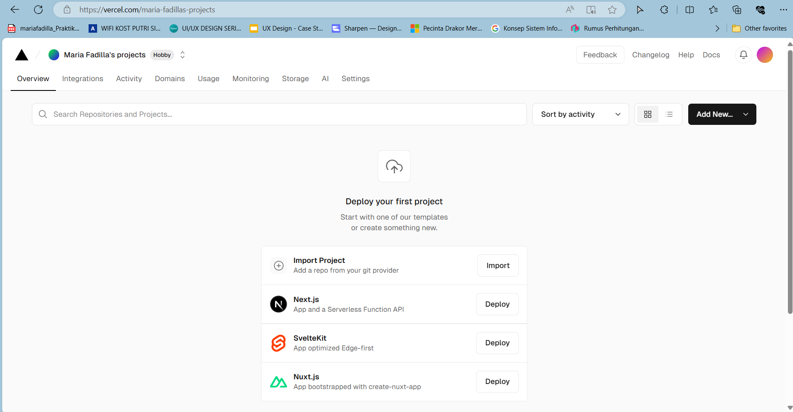

# 09-nextjs-database

#### For Others Project, Please Visit: 
https://github.com/mariafadilla15/Pemrograman-Berbasis-Framework.git

  

# **Laporan Praktikum - #09 Setup Database dan Fetching Data (API)**

|  | Pemrograman Berbasis Framework 2024 |
|--|--|
| NIM |  2141720063|
| Nama |  Maria Fadilla |
| Kelas | TI - 3A |

 

## **Praktikum 1: Setup Database**
---

Menggunakan starter code yang sudah ada, lalu melakukan setup database dengan PostgreSQL menggunakan library @vercel/postgres. Langkah-langkahnya adalah berikut: 

- **Membuat project baru dengan template**

Membuat repo berdasarkan templat starter code ini: https://github.com/jti-polinema/09-nextjs-database kemudian beri nama repo: 09-nextjs-database pada akun GitHub.

- **Membuat Akun Vercel**

